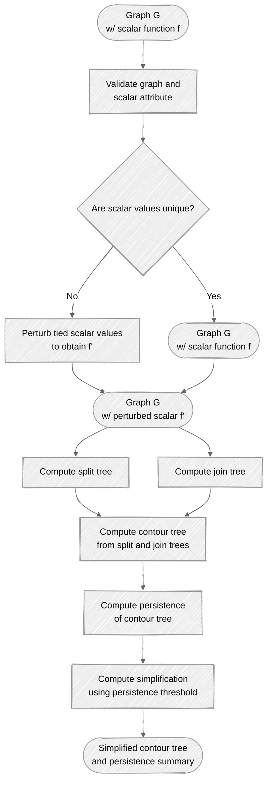

# TopoGraph

<a target="_blank" href="https://cookiecutter-data-science.drivendata.org/">
    
</a>

Topological analysis on graphs and networks.

## Project Oragnization

### Structure

```text
├── .gitignore
├── docs/                       <- Quarto documentation project
│   ├── _quarto.yml
│   ├── index.qmd               <- Documentation homepage
│   ├── api.qmd                 <- API reference
│   ├── cli.qmd                 <- CLI documentation
│   ├── theory/                 <- Theoretical background
│   │   ├── split_join_trees.qmd
│   │   ├── contour_tree.qmd
│   │   └── persistence.qmd
│   └── examples/               <- Tutorial examples
│       ├── path_graph.qmd
│       └── branching_graph.qmd
├── examples/                   <- Example scripts and data
│   ├── example_scalar_graph.py
│   └── example_cli.sh
├── src/
│   └── topograph/              <- Main package source code
│       ├── __init__.py
│       ├── cli.py              <- Command-line interface
│       ├── exceptions.py        <- Custom exceptions
│       ├── pipeline.py          <- Main pipeline orchestration
│       ├── algorithms/          <- Core topological algorithms
│       │   ├── __init__.py
│       │   ├── split_tree.py
│       │   ├── join_tree.py
│       │   ├── contour_tree.py
│       │   ├── persistence.py
│       │   └── simplify.py
│       ├── core/               <- Core utilities and data structures
│       │   ├── __init__.py
│       │   ├── validation.py
│       │   ├── ordering.py
│       │   ├── filtration.py
│       │   └── unionfind.py
│       ├── models/             <- Data models and structures
│       │   ├── __init__.py
│       │   ├── split_join.py
│       │   ├── contour_tree.py
│       │   └── persistence.py
│       ├── io/                 <- Input/output handlers
│       │   ├── __init__.py
│       │   ├── graphml.py
│       │   └── json.py
│       ├── transforms/         <- Graph transformations
│       │   ├── __init__.py
│       │   └── perturb.py
│       └── workflows/          <- High-level workflows
│           ├── __init__.py
│           └── contour_pipeline.py
├── tests/                      <- Unit and integration tests
│   ├── test_split_join.py
│   ├── test_contour_tree.py
│   ├── test_simplify.py
│   └── test_cli.py
├── LICENSE                     <- Open-source license
├── Makefile                    <- Convenience commands
├── README.md                   <- This file
├── pyproject.toml              <- Project configuration and dependencies
└── pixi.toml                   <- Pixi environment configuration
```

### Workflow



# References

## Package Building

- <https://pixi.prefix.dev/latest/build/python/>
- <https://packaging.python.org/>
- <https://typer.tiangolo.com/tutorial/package/>
- <https://typer.tiangolo.com/tutorial/one-file-per-command/>

## Topology

- <https://topology-tool-kit.github.io/>
- <https://github.com/maljovec/topopy>

## Graphs and Networks

- <https://networkx.org/en/>
