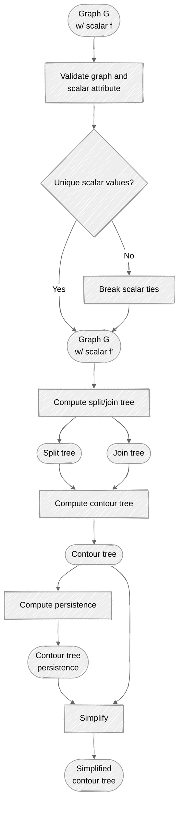

# TopoGrapher

<a target="_blank" href="https://cookiecutter-data-science.drivendata.org/">
    
</a>
<a target="_blank" href="https://pixi.prefix.dev/">
    
</a>
<a target="_blank" href="https://typer.tiangolo.com/">
    
</a>

Topological analysis on graphs and networks.

## Project Oragnization

### Structure

```text
├── .gitignore
├── docs/                       <- Quarto documentation project
│   ├── _quarto.yml
│   ├── index.qmd               <- Documentation homepage
│   ├── api.qmd                 <- API reference
│   ├── cli.qmd                 <- CLI documentation
│   ├── theory/                 <- Theoretical background
│   │   ├── split_join_trees.qmd
│   │   ├── contour_tree.qmd
│   │   └── persistence.qmd
│   └── examples/               <- Tutorial examples
│       ├── path_graph.qmd
│       └── branching_graph.qmd
├── examples/                   <- Example scripts and data
│   ├── example_scalar_graph.py
│   └── example_cli.sh
├── src/
│   └── topographer/              <- Main package source code
│       ├── __init__.py
│       ├── cli.py              <- Command-line interface
│       ├── exceptions.py        <- Custom exceptions
│       ├── pipeline.py          <- Main pipeline orchestration
│       ├── algorithms/          <- Core topological algorithms
│       │   ├── __init__.py
│       │   ├── split_tree.py
│       │   ├── join_tree.py
│       │   ├── contour_tree.py
│       │   ├── persistence.py
│       │   └── simplification.py
│       ├── core/               <- Core utilities and data structures
│       │   ├── __init__.py
│       │   ├── validation.py
│       │   ├── ordering.py
│       │   ├── filtration.py
│       │   └── unionfind.py
│       ├── models/             <- Data models and structures
│       │   ├── __init__.py
│       │   ├── tree.py
│       │   └── persistence.py
│       ├── io/                 <- Input/output handlers
│       │   ├── __init__.py
│       │   ├── graphml.py
│       │   └── json.py
│       ├── transforms/         <- Graph transformations
│       │   ├── __init__.py
│       │   └── perturb.py
│       └── workflows/          <- High-level workflows
│           ├── __init__.py
│           └── contour_pipeline.py
├── tests/                      <- Unit and integration tests
│   ├── test_split_join.py
│   ├── test_contour_tree.py
│   ├── test_simplify.py
│   └── test_cli.py
├── LICENSE                     <- Open-source license
├── Makefile                    <- Convenience commands
├── README.md                   <- This file
├── pyproject.toml              <- Project configuration and dependencies
└── pixi.toml                   <- Pixi environment configuration
```

### Workflow



## CLI Convert Example

Use `topographer convert` to convert graph files between `pkl`, `graphml`, `gml`, `gexf`, and `json`.

Show command help:

```bash
topographer convert --help
```

Convert between formats:

```bash
topographer convert data/source.pkl data/converted.json
topographer convert data/source.graphml data/converted.gml --source-format graphml --target-format gml
```

## Breaking Ties

Use `topographer.transforms.perturb` to deterministically break tied scalar values
without changing graph topology.

Main API:

- `has_ties(G, scalar)`
- `find_ties(G, scalar)`
- `perturb_ties(G, scalar, ...)`
- `is_strictly_ordered(G, scalar)`

CLI usage:

```bash
topographer perturb data/input.pkl data/output.pkl
topographer perturb data/input.pkl data/output.pkl --scalar scalar --output-scalar scalar_perturbed
```

The command writes a new graph file with tied groups perturbed in a deterministic
lexicographic order.

## Trees

Use staged commands to compute base trees first, then run augmentation as a
separate step:

```bash
topographer tree join data/input.pkl data/join_tree.pkl
topographer tree split data/input.pkl data/split_tree.pkl
topographer tree contour data/input.pkl data/contour_tree.pkl

topographer augment join data/input.pkl data/join_tree_aug.pkl
topographer augment split data/input.pkl data/split_tree_aug.pkl
topographer augment contour data/input.pkl data/contour_tree_aug.pkl
```

Contour tree construction does not perform augmentation automatically.
Use `topographer augment contour ...` when you need the augmented contour tree.

API usage follows the same staged pattern:

```python
from topographer import compute_contour_tree, augment_contour_tree

CT = compute_contour_tree(graph, scalar="scalar")
aCT = augment_contour_tree(CT)
```

`CT` is a rich wrapper object with graph topology plus split/join context:

- `CT.graph`: contour tree topology (`nx.Graph`)
- `CT.JT` / `CT.join_tree`: join tree wrapper
- `CT.ST` / `CT.split_tree`: split tree wrapper
- `CT.scalar`: scalar attribute name

## Persistence

Persistence is available via two explicit paths:

- split/join first, then persistence
- contour tree wrapper, then persistence

CLI usage:

```bash
topographer persistence compute data/input.pkl data/persistence_split_join.json --mode split-join
topographer persistence compute data/input.pkl data/persistence_contour.json --mode contour
```

API usage:

```python
from topographer.algorithms.contour_tree import compute_contour_tree
from topographer.algorithms.join_tree import compute_join_tree
from topographer.algorithms.persistence import (
    compute_persistence_from_contour_tree,
    compute_persistence_from_split_join,
)
from topographer.algorithms.split_tree import compute_split_tree

ST = compute_split_tree(graph, scalar="scalar")
JT = compute_join_tree(graph, scalar="scalar")
pairs_split_join = compute_persistence_from_split_join(ST, JT)

CT = compute_contour_tree(graph, scalar="scalar")
pairs_contour = compute_persistence_from_contour_tree(CT)
```

# References

## Package Building

- <https://pixi.prefix.dev/latest/build/python/>
- <https://packaging.python.org/>
- <https://typer.tiangolo.com/tutorial/package/>
- <https://typer.tiangolo.com/tutorial/one-file-per-command/>

## Topology

- <https://topology-tool-kit.github.io/>
- <https://github.com/maljovec/topopy>

## Graphs and Networks

- <https://networkx.org/en/>
